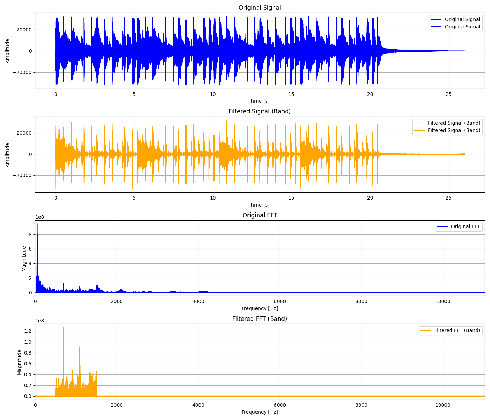

# Audio Processing

The repository was made for DSP Class Assignment. The repository was created using Python with Scipy, Numpy, and Matploylib Library.

## The Results of Filtering Plot

### High Pass Filter

